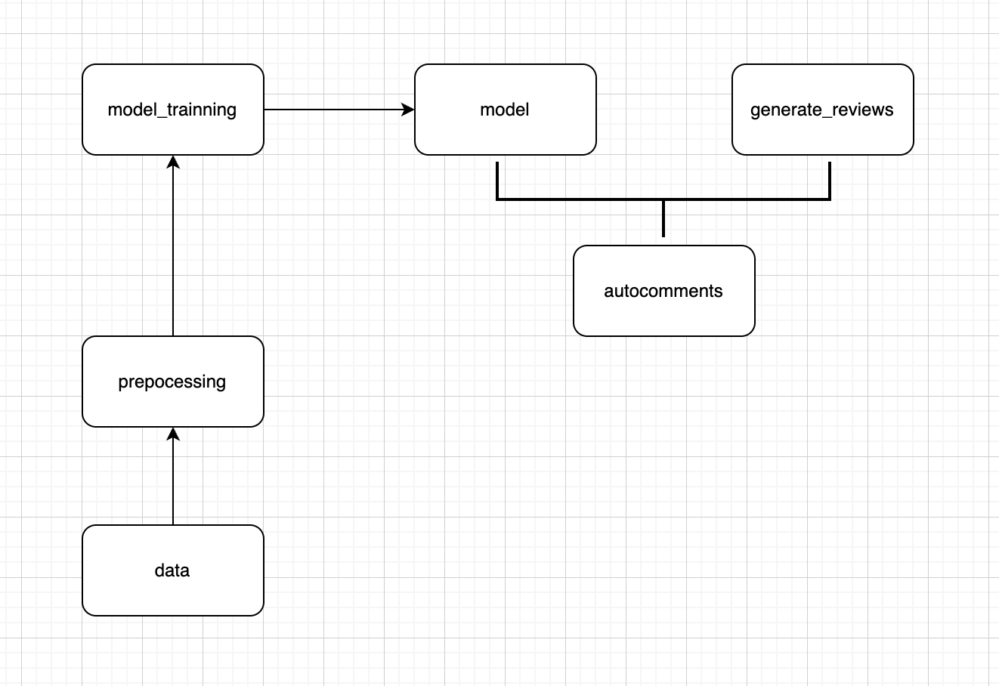

# dsan5400-finalproject

## Auto Review Generator

### Group member: Haoyu Wang, Siyuan Zhang, Leqi Ying, Elliot Li

#### Background

Auto commenting refers to the process of automatically generating and posting comments, typically on websites, social media platforms, or within software applications.

Enhanced Engagement: help maintain a consistent level of activity and engagement on posts

Efficient Customer Service: provide quick responses to common queries in customer service

Time-Saving: individuals and businesses can save significant amounts of time

Consistency in Messaging: ensures that the messaging remains consistent

24/7 Availability: providing responses and interactions even during off-hours

Scalability: can handle a large volume of interactions simultaneously

#### Dataset

Amazon Review Data (2018)

This dataset includes reviews (ratings, text, helpfulness votes) and product metadata.

More information can be found in https://nijianmo.github.io/amazon/index.html

The data we mainly use for the project is the 5-core for Software part.

#### Preprocessing

This includes removing special characters, converting text to lowercase, removing stop words, and stemming or lemmatization.

The preprocessing and cleaning part can be found in preprocessing.ipynb.

#### Model

We trained Naive Bayes, support vector machine, random forest, K-nearest neighbors models. Overall, SVM performed the best.

The training steps can be found in model_training.ipynb. The result can be observed in discussion.md.

#### Auto comment generation

Using large language models, we can generate comments from given prompts. By aligning with the original scoring distributions of reviews, this method allows for generating comments that more closely mirror the original distribution.

You can use code in autocomment.py to generate comments as you need.

By using the data set we already have, we clean the data and then train a series of machine learning models.
We used Amazon's rating rating dataset to rate different reviews using a trained model on a scale of 1-5.

Prompts are given to the generation model to automatically generate comments by using ChatGPT2.
Again, the existing scoring model is used to score and filter a large number of generated comments, so that the scores of generated comments are consistent with the scores of the training set.

Randomly select one of the generated comments to ensure the fairness of randomly generated comments.

#### References

Justifying recommendations using distantly-labeled reviews and fined-grained aspects
Jianmo Ni, Jiacheng Li, Julian McAuley
Empirical Methods in Natural Language Processing (EMNLP), 2019